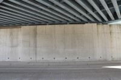
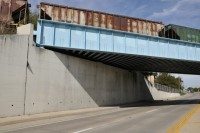
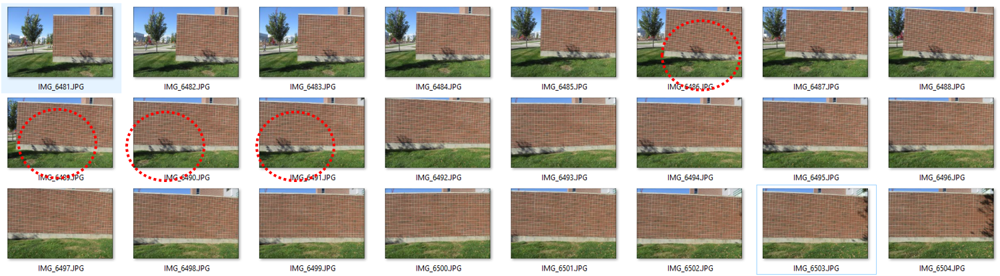
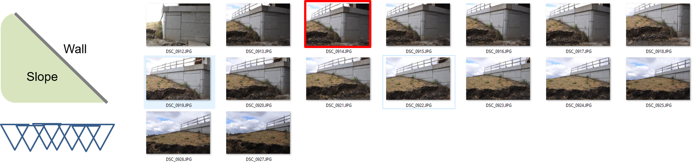

# Image Collection Guideline

In order to get high accuracy measurement results, an image collection plan is the most important. The main rule is to cover the entire area of the target wall plane with high overlaps between the images. Since many images are collected manually in a short time on the site, the collected images are inadequate in terms of constructing a quality orthophotos and processing requirements. As the image collection plan has a high impact on the quality of the results, it is important to follow the suggested guidelines.

## General guideline
1. At least 75% side and vertical overlaps between the images are required.    
2. Camera should be maintained as much as possible at a constant distance over the wall.
3. The image plane is recommended to be parallel to the wall plane.
4. Close-up images easily get wrong due to insufficient overlap.
5. The wall areas is recommended to be at the center of the images and take up more than 75% of images ares. 
6. Small horizontal or vertical angles (less than 20~30 degree) are allowed but great care should be taken when you take objects are not on the same plane (see figure 6). 
7. Images should be captured at different locations, not by angle rotation. 

### Image collection strategy

#### 
| Layout | Image |
| :----------: |:-------------:|
|||
||| 

#### Good and Bad Practice 

|Practice | Layout | Note |
| :--: | :--------  | :-----|
| **Bad**  |  | <ul><li> Not enough overlap between the images </li><li> Do not cover entire wall areas with the images </li></ul>|
| **Bad**  | | Evaluation |
| **Bad**  | | Evaluation |
| **Bad**  | | Evaluation |
| **Good** | | Evaluation |

## Advanced guideline
* It is recommended to use consumer grade compact and DSLR cameras. The camera on the smart phone may produces large distortion on the images, which does not follow a pin-hole camera geometry. 

* Camera setting
	* The zoom should be stable 
	* Fixed (manual) focal length is recommended (not use autofocus mode).
	* Stabilization settings should be off.
	* Shutter/aperture/ISO should be on automatic
	
## Some issues in the field

### Moving objects

**Problem**: Moving objects are included in the images, such as cars, pedestrians or shadow.  
**Solution**: More images are collected at the similar locations to minimize the effect coming from the moving objects.

### Inaccessible areas

Due to the slope, images can not be captured under parallel to the wall. 

**Problem**: Moving objects are included in the images, such as cars, pedestrians or shadow.  
**Solution**: More images are collected at the similar locations to minimize the effect coming from the moving objects.

#### 