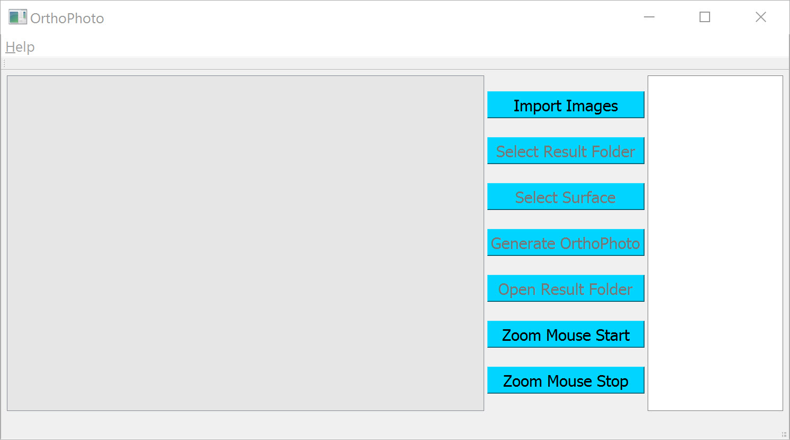

# Example of The Orthophoto Tool Usage

This example illustrates how to create a high-quality orthophoto using our orthophoto tool. Example images are already included in the distributed package. 

## Getting Started
* Please watch the video for more details on the usage in this example: [**Video**](XXXX) (05m 17s)
* Please refer to help using the menu bar, or just press **F1**.    
* Please see the example results file [**jpg**](Bowen.jpg). 

1. Download `XXXX.zip` from the [**Link**]()  
2. Please unzip the package and place the folder **anywhere on the your computer (ANUP-CHANGE).** You can see the menu if you do left click (see figure). Please do not just double click the zip file to run the program.  
3. Run `XXX.exe` in the unzipped folder.  

## Orthophoto genration

  
### Step 01: Start program
Double click on `OrthoPhoto.exe` in the `xxx` folder and enter your contract, project, and pay item numbers in each pop-up window.       

### Step 02: Import images
After clicking the **Import Images** button, navigate to the folder where the images are and select the images while holding a shift button in the keyboard. When done selecting, press ok.

### Step 03: Select Surface
After clicking the **Select Surface**, select an image that has the wall surface where you make a measurement. When the image is displayed in the viewer, left click along the surface to be selected, in order. Select at least 4 points along the surface.

### Step 04: Generate Orthophoto
When done selecting points along the surface, click the **Generate Orthophoto** button.
