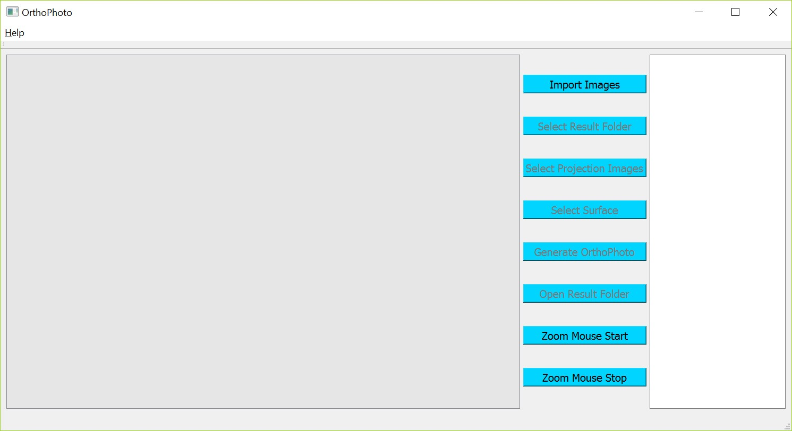

# Example of The Orthophoto Tool Usage

This example illustrates how to create a high-quality orthophoto using our orthophoto tool. Example sample image sets are downloaded from this link:
**[Link](https://github.com/chulminy/JTRP_Project/blob/master/iPhoneSample/sample_image.md)**   

## Getting Started
* Please watch the video for more details on the usage in this example: [**Video**](https://youtu.be/FWuhwjFmIn0) (03m 03s)
* Please refer to help using the menu bar, or just press **F1**.    

1. Download `OrthoPhoto_04_24_2017.zip` from the **[Link](https://my.syncplicity.com/share/vfunzhpuvdouzhw/OrthoPhoto_04_24_2017)**    
2. Please unzip the package and place the folder **in C:/ or D:/ (or the path without spaces).** 
3. **Please do not just double click the zip file to run the program.**  
3. Run `OrthoPhoto.exe` in the unzipped folder.  

## Orthophoto Genration

  
### Step 01: Start program
Double click on `OrthoPhoto.exe` in the `OrthoPhoto_04_24_2017` folder and enter your contract, project, and pay item numbers in each pop-up window.       

### Step 02: Import images
After clicking the **Import Images** button in the menu bar on the top, navigate to the folder where the images are and select the images. When done selecting, press ok.

### Step 03: Select Results Folder
click **Select Result Folder** to designate the folder where you will save the orthophoto, and press ok. Any folder can be selected.

### Step 04: Select Projection Images
click **Select Projection Images** to assign the images that are used for projection and blending.  

### Step 05: Select Surface
click **Select Surface**, and select an image that has a clear view of the planar wall surface where you will make your measurements. Note that the best image for this surface selection: (1) is parallel to the wall, and (3) has no blur and is not too bright or too dark.

### Step 06: Generate Orthophoto
When done selecting points along the surface, click the **Generate Orthophoto** button.

It will take a few minutes to a few hours to complete the computations needed for the orthophoto. Once the processing is finished, the final orthophoto will be placed in the folder assigned. You may also simply click Open Result Folder.

Here is the final orthophoto:

