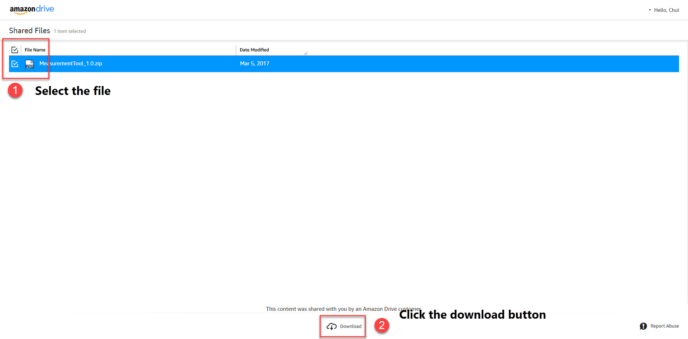
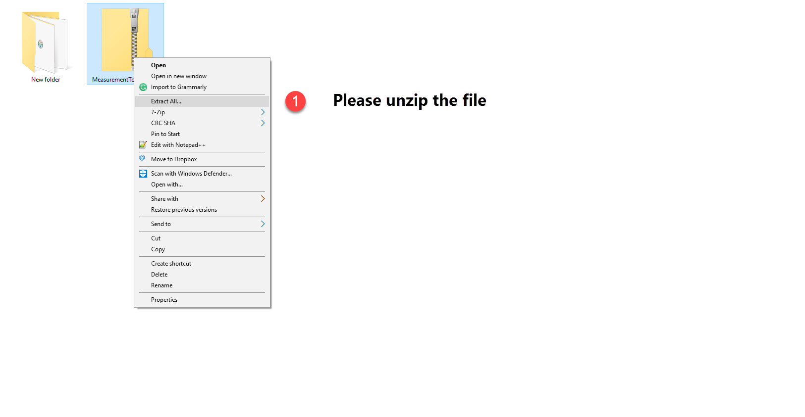
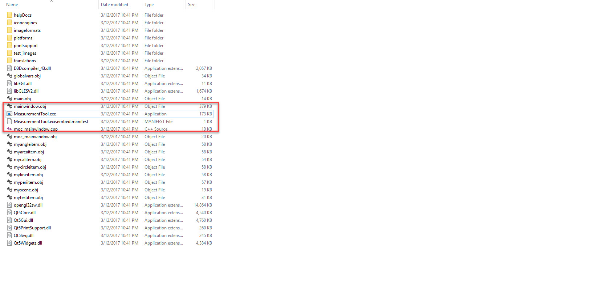
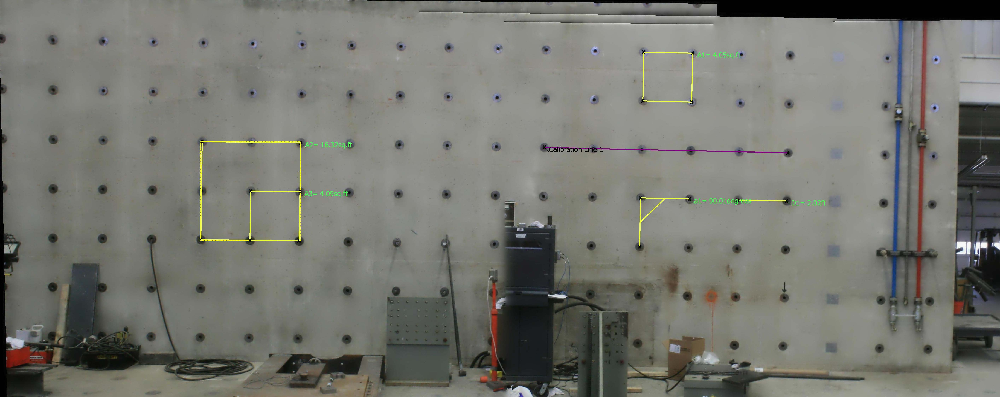
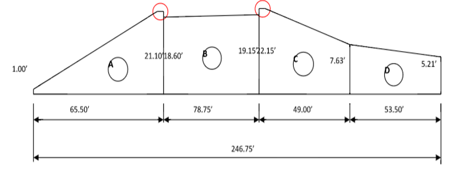
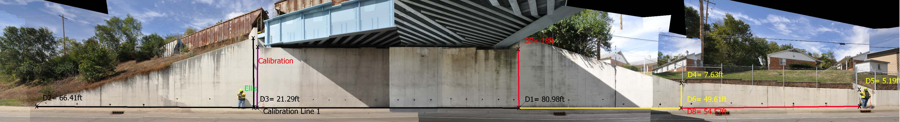

# Example of The Measurement Tool Usage

This example illustrates how to make measurements using our measurement tool. Example images  are already included in the distributed package. 

## Getting Started

Please watch the video for more details on running the program: [**Video**](https://youtu.be/Bh0zkw-KAHE) (01m 19s)   

1. Download `MeasurementTool 1.0.zip` from the [**Link**](https://www.amazon.com/clouddrive/share/PMqG7E7n2d2e7kQ5qruuJiix3pqDazje1rXansPDmL8?ref_=cd_ph_share_link_copy)

2.Please unzip the package and place the folder anywhere on the your computer. Please do not just click the zip file.
 

3.Run `MeasurementTool.exe` in the unzipped folder. 

## Example (Bowen Wall)
* Please watch the video for more details on the usage in this example: [**Video**](https://youtu.be/oNpxRYDU8ak?list=PLa1nAPP8qUX_0Zi166iNi7eb0w23UCekY) (05m 17s)   
* Please refer to help using the menu bar, or just press **F1**. 
* Please see the example results file [**PDF**](measurement_bowen.pdf). 

### Measurement using our tool

  
#### Step 01: Start program
Double click on `MeasurementTool.exe` in the `MeasurementTool_Release_1.0` folder.    

#### Step 02: Input project information
Enter your contract, project, and pay item numbers in each pop-up window (for this example, use demo info).     

#### Step 03: Load the orthophoto image 
On the menu bar, click **File>Load image**. The test image is **`Bowen.jpg`** in the **`test_images`** folder.  

#### Step 04: Crop the image
First, zoom-out the image to fit in the display window. To do this, click ***start*** under ***Zoom With Mouse***. You can hover over the image using a mouse wheel or touch pad in your computer. **You must click** ***stop*** **button to exit the zoom mode, and use the other functions.** 

Then, to crop out unnecessary parts,  on the menu bar, click **Edit>Crop**. Draw a rectangle over the portion of the image that you want to keep. First left click at the top left corner of the region you want to crop. Hold the mouse and move to the bottom right corner of the region you want to keep. When you release the button, a yellow dashed box will appear around the region. Release the mouse, and a window will appear asking if the region selected is correct or not. If correct, press OK and the selected region will be cropped. If not, click cancel and repeat the steps. 

> **Note that cropping should be performed before making any measurements or else the measurements will be lost.**

#### Step 05: Calibrate the image using a known length 
Enter the length of a known distance in the blank under ***Calibrate***. Click ***select*** and two end points. The unit of measurement can be selected from the drop down menu next to the blank. Supported units are "ft" (feet) and "yd" (yard). Once you finish selecting two points (both ends), click ***Apply***. For this example, a distance between bolt holes is 2 ft.   

> **Note that use of a longer calibration line improves the accuracy of the measurement.**   

#### Step 06: Change line width and color, and font size and color  
You can edit the line width, line color, font size, and text color. In this example, a black line of width 5 and a red font of size 25 are used.

> **Note that these parameters must be changed before drawing individual line or text, and cannot be modified after measurement using the Modify function.**   

#### Step 07: Measurement 
* Distance measurement 
* Angle measurement 
* Perimeter measurement 
* Annotation of a text label on the item
* Use of the modify function 
* Add or subtract areas  

Please refer to ***Help***.

#### Step 08: Save measurements
On the menu bar, click **File>Save**. Select the folder where you want to save the results. Then, type a name for the filename and press OK. The image will be saved as a PDF file and the log will be automatically saved using CSV format.

## Example (Bridge Abutment)
* Please watch the video for details on the usage in this example: [**Video**](https://youtu.be/MxnvdGGmSvs?list=PLa1nAPP8qUX_0Zi166iNi7eb0w23UCekY) (11m 4s)  
* Please see the output measurement [**PDF**](measurement_wall.pdf).

### On-site measurement 

### Measurement using our tool

